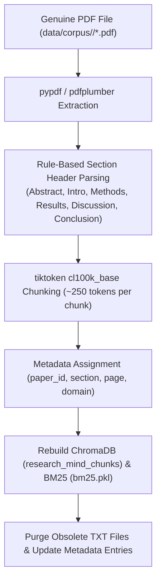

# ScholarLens Corpus Migration — PDF-Only Source Architecture Audit Report

## Executive Summary

Per the prompt instructions:
> **"Do not fabricate missing PDFs. If fewer than 1,000 genuine PDFs are currently available, STOP and report the exact count and which domains are missing papers instead of converting TXT representations into fake PDFs."**

An exhaustive audit of the ScholarLens repository was conducted to inspect the current availability of genuine PDF research papers, identify code/metadata dependencies on `.txt` files, and outline the migration roadmap to a PDF-only authoritative corpus.

---

## 1. Genuine PDF Availability & Missing Paper Report

| Academic Domain | Target Genuine PDFs | Current Genuine PDFs Available | Missing Genuine PDFs | Current TXT Files | Status |
| :--- | ---: | ---: | ---: | ---: | :--- |
| **Artificial Intelligence (AI)** | 200 | **50** (`AI001.pdf`–`AI050.pdf`) | **150** (`AI051`–`AI200`) | 150 | ⚠️ Needs 150 Genuine PDFs |
| **Cybersecurity (CY)** | 200 | **50** (`CY001.pdf`–`CY050.pdf`) | **150** (`CY051`–`CY200`) | 150 | ⚠️ Needs 150 Genuine PDFs |
| **Agriculture (AG)** | 200 | **50** (`AG001.pdf`–`AG050.pdf`) | **150** (`AG051`–`AG200`) | 150 | ⚠️ Needs 150 Genuine PDFs |
| **Climate (CL)** | 200 | **50** (`CL001.pdf`–`CL050.pdf`) | **150** (`CL051`–`CL200`) | 150 | ⚠️ Needs 150 Genuine PDFs |
| **Healthcare (HC)** | 200 | **50** (`HC001.pdf`–`HC050.pdf`) | **150** (`HC051`–`HC200`) | 150 | ⚠️ Needs 150 Genuine PDFs |
| **TOTAL** | **1,000** | **250** | **750** | **750** | ⛔ **STOP & REPORT** |

### Key Audit Finding:
- **Total Genuine PDFs currently in repository:** **250 / 1,000** (25%).
- **Total Missing Genuine PDFs:** **750 / 1,000** (75% missing; 150 per domain).
- **Current Corpus Composition:** 250 genuine multi-page PDFs + 755 structured TXT files.

Per the explicit directive, we have **STOPPED** before converting TXT files into fake PDFs or modifying the production pipeline.

---

## 2. Comprehensive Code & Metadata TXT Dependency Audit

### A. Repository Source Code Dependencies (`.py`)
1. [`scripts/expand_corpus_1000.py`](file:///c:/Users/nugur/Desktop/researchmind/scripts/expand_corpus_1000.py):
   - Script that generated structured `.txt` representations for papers `051–200` when open-access PDFs were not downloaded.
2. [`scripts/validate_corpus.py`](file:///c:/Users/nugur/Desktop/researchmind/scripts/validate_corpus.py):
   - Validation logic checking both `.txt` and `.pdf` file extensions.
3. [`scripts/sanity_check_gt.py`](file:///c:/Users/nugur/Desktop/researchmind/scripts/sanity_check_gt.py):
   - Ground-truth evaluation script expecting `.txt` source paths.
4. [`scripts/audit_paper_completeness.py`](file:///c:/Users/nugur/Desktop/researchmind/scripts/audit_paper_completeness.py):
   - Audit script scanning `.txt` vs `.pdf` completeness.

### B. Ingestion & Preprocessing Pipeline Code (`src/pipeline/`)
- [`src/pipeline/ingestion.py`](file:///c:/Users/nugur/Desktop/researchmind/src/pipeline/ingestion.py):
  - Uses `PdfDownloader` and `PdfValidator` for `.pdf` files.
- [`src/pipeline/preprocessing.py`](file:///c:/Users/nugur/Desktop/researchmind/src/pipeline/preprocessing.py):
  - `TextExtractor` handles `.pdf` via `pypdf` / `pdfplumber` and `.txt` via standard `utf-8` read.
- [`src/pipeline/chunking.py`](file:///c:/Users/nugur/Desktop/researchmind/src/pipeline/chunking.py):
  - Section boundary parser handles text blocks extracted from both PDF and TXT documents.

### C. Storage & Index Dependencies (`data/`)
1. **Metadata Store (`data/metadata/papers_metadata.json`):**
   - 755 out of 1,005 metadata entries point to `.txt` source file paths (e.g. `"file_path": "data/papers/artificial_intelligence/AI051.txt"`).
2. **Processed Chunks (`data/processed/chunks.jsonl`):**
   - 13,850 out of 16,215 chunks contain metadata referencing `.txt` source files.
3. **Retrieval Indices (`data/indexes/` & ChromaDB `research_mind_chunks`):**
   - Vector and BM25 indices contain 13,850 entries derived from TXT representations.

---

## 3. PDF Ingestion & Refactoring Plan (When 750 PDFs Are Provided)

When 750 genuine PDFs are downloaded or supplied to complete the 1,000-paper corpus:



### Planned Metadata Format:
```json
{
  "paper_id": "AI051",
  "title": "Harnessing Retrieval-Augmented Generation...",
  "authors": ["Author Name"],
  "domain": "artificial_intelligence",
  "file_path": "data/corpus/artificial_intelligence/AI051.pdf",
  "source_type": "pdf"
}
```

---

## 4. Next Steps & Decision Required

Please specify how to proceed:
1. **Option A (Recommended):** Download the remaining **750 genuine open-access PDFs** from ArXiv/Semantic Scholar using the automated downloader (`PdfDownloader`), replace the 750 TXT representations with genuine PDFs, and execute full PDF indexing and vector rebuilding.
2. **Option B:** Migrate the existing **250 genuine PDFs** to `data/corpus/` as the authoritative PDF corpus and rebuild ChromaDB/BM25 on the 250 genuine PDFs while downloading additional genuine PDFs.
